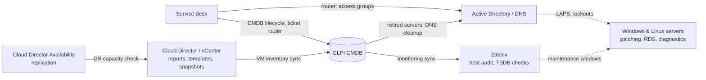

### Infrastructure / Systems Engineer
Windows & Linux · VMware vCloud Director · automation

> **🇷🇺 Кратко.** Инженер инфраструктуры: Windows Server и Linux, виртуализация на VMware vCloud Director / vCenter,
> автоматизация рутины на PowerShell, Bash и Python. Здесь — обобщённые версии моих рабочих скриптов:
> жизненный цикл ВМ, интеграция с ITSM/CMDB, мониторинг, патчинг, RDS.

---

**What I do**

- Automate the VM lifecycle on VMware vCloud Director / vCenter — templates, snapshots, replication, capacity and usage reports.
- Integrate infrastructure with ITSM / CMDB over REST APIs (GLPI, generic service desk APIs).
- Run monitoring with Zabbix — host lifecycle audits, templates, database health checks.
- Plan and test disaster recovery and migrations: replication, capacity checks for the recovery site.
- Patch and maintain Windows Server fleets; administer Active Directory, LAPS and Remote Desktop Services (UPD / FSLogix).

**Stack**

     

   

     

   

**Featured**

- **DR readiness in one command.** Before a failover test, [Test-DRCapacity.ps1](https://github.com/Manick351/vmware-cloud-toolkit/blob/main/dr/Test-DRCapacity.ps1)
  checks replication health and the age of the latest replica against the RPO, then compares vCPU, RAM and storage needs with the free capacity at the recovery site.
- **Templates that patch themselves.** [Update-VcdTemplate.ps1](https://github.com/Manick351/vmware-cloud-toolkit/blob/main/templates/Update-VcdTemplate.ps1)
  deploys a catalog template, patches and seals the guest, captures it back, and keeps the previous version as a fallback.
- **The service desk feeds the CMDB.** [Invoke-CmdbLifecycle.ps1](https://github.com/Manick351/itsm-cmdb-automation/blob/main/cmdb/Invoke-CmdbLifecycle.ps1)
  turns closed deployment and decommission tasks into GLPI records and Zabbix changes. [Invoke-TicketRouter.ps1](https://github.com/Manick351/itsm-cmdb-automation/blob/main/tickets/Invoke-TicketRouter.ps1)
  handles routine tasks and hands the rest to people in turn.
- **Patching without surprises.** [Invoke-ServerPatching.ps1](https://github.com/Manick351/windows-server-ops/blob/main/patching/Invoke-ServerPatching.ps1)
  patches servers in parallel, limits how many reboot at once, waits for boot and checks that services came back.

**How the pieces fit**

**Repositories**

| Repository | What's inside |
|---|---|
| [rds-toolkit](https://github.com/Manick351/rds-toolkit) | RDS farms with UPD / FSLogix: profile disk inventory, compaction, cache cleanup, broken profile repair, diagnostics, helpdesk GUI |
| [windows-server-ops](https://github.com/Manick351/windows-server-ops) | Windows Server fleet: parallel patching with reboot control, LAPS/AD checks, lockout tracing, mass logoff, disk and profile cleanup, free IP search, access and Tomcat audits |
| [vmware-cloud-toolkit](https://github.com/Manick351/vmware-cloud-toolkit) | VMware Cloud Director / vCAV / vCenter: VM and capacity reports, DR readiness check, replication management, snapshots across vCenters, automated template updates |
| [itsm-cmdb-automation](https://github.com/Manick351/itsm-cmdb-automation) | GLPI CMDB, Zabbix and service desk automation: server lifecycle from tickets, inventory and monitoring sync, DNS cleanup of retired servers, ticket router, workload analytics |
| [linux-admin-scripts](https://github.com/Manick351/linux-admin-scripts) | Linux operations: hang diagnostics, AD lockout source search, Zabbix and TimescaleDB health checks, log health playbook, disk burn-in |
| [anyconnect-totp-login](https://github.com/Manick351/anyconnect-totp-login) | Cisco AnyConnect CLI login with TOTP — credentials kept in SecretManagement / DPAPI, never in plain text |

All scripts in my repositories are generalized from real-world tasks: company names, hosts, addresses and internal systems are replaced
with placeholders (`contoso.local`, `srv-app-01`, `192.0.2.x`). Most of them default to a dry run (`-WhatIf` / `--dry-run`).
